# 필라멘트 교체방법

기본적인 교체 방법은 동일하나 필라멘트 스풀 거는 위치가 다르기 때문에 프린터별로 차이점을 확인해주세요.

### 0. 기존 필라멘트 제거 - 공통

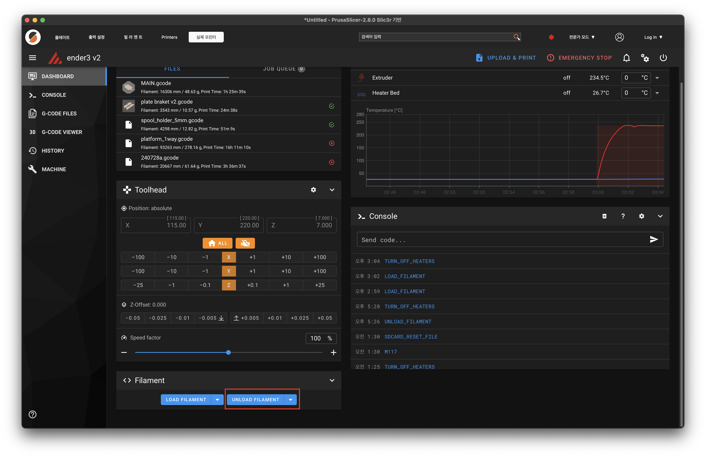

프루사 슬라이서에서 교체하고자 하는 프린터를 선택하시고 상단에 실제 프린터를 클릭하시면 위 사진과 같은 컨트롤 화면이 나옵니다.

하단에 있는 unload_filament 버튼을 클릭 후 대기

자동으로 필라 교체 온도까지 상승 후 필라멘트 제거 과정을 시행합니다.

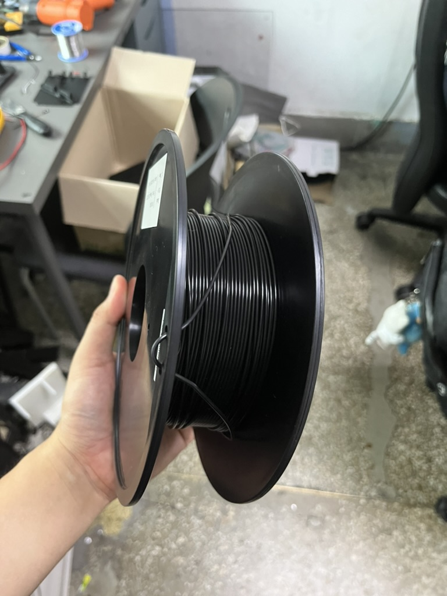

스풀 홀더에서 보빈을 제거하고 필라가 남아있다면 위 사진처럼 풀리지 않도록 측면 홀에 끼워주세요

### 1 - 1. 새로운 필라멘트 설치 - Ender3

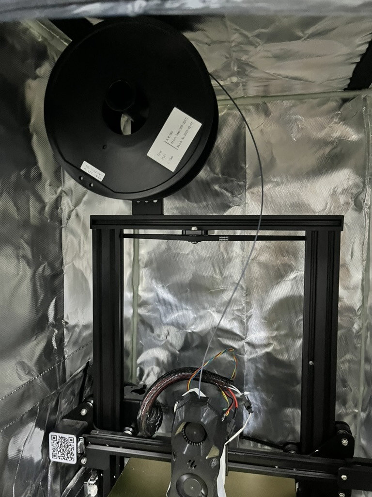

상단 스풀 홀더에 다시 보빈을 거는데, 이때 보빈의 뱡향에 주의하세요.

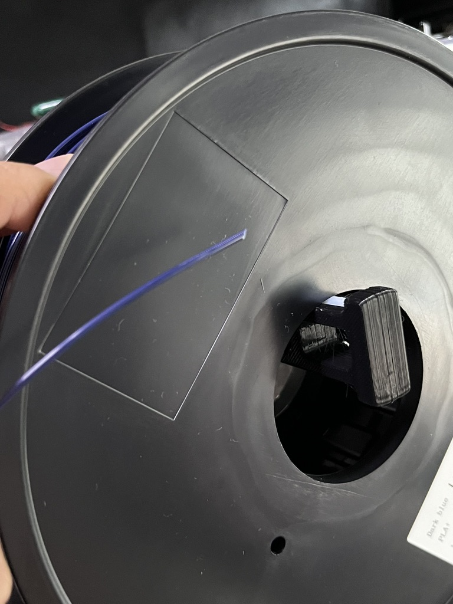

위 사진처럼 필라멘트 끝 부분을 니퍼 등을 이용해서 사선으로 잘라주세요.

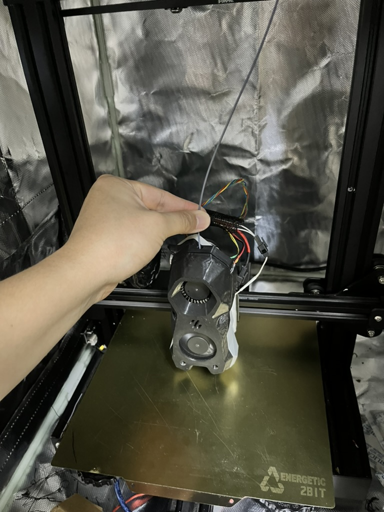

필라 삽입구에 위와 같이 수동으로 옮겨서 안들어갈 때 까지 밀어넣으세요.

### 1 - 2. 새로운 필라멘트 설치 - SP3 Tri

위 사진처럼 필라멘트 끝 부분을 니퍼 등을 이용해서 사선으로 잘라주세요.

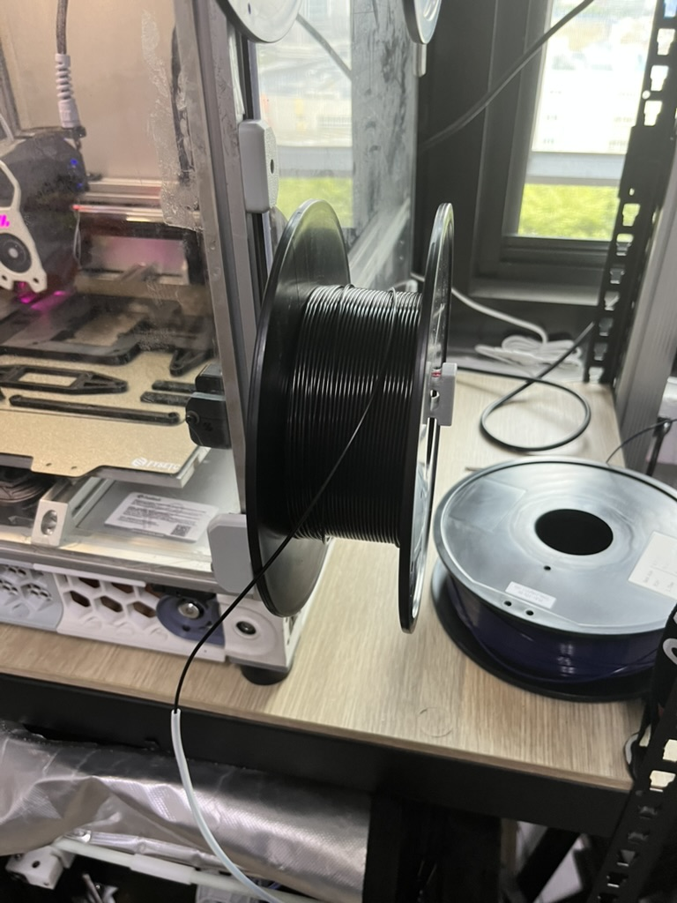

SP3의 경우 스풀 홀더가 Voron 2.4 하단에 위치해 있습니다. 해당 위치에 걸어주시고 흰색 ptfe 튜브를 통해 안들어갈때 까지 밀어넣어주세요.

### 1 - 3. 새로운 필라멘트 설치 - Voron 2.4

위 사진처럼 필라멘트 끝 부분을 니퍼 등을 이용해서 사선으로 잘라주세요.

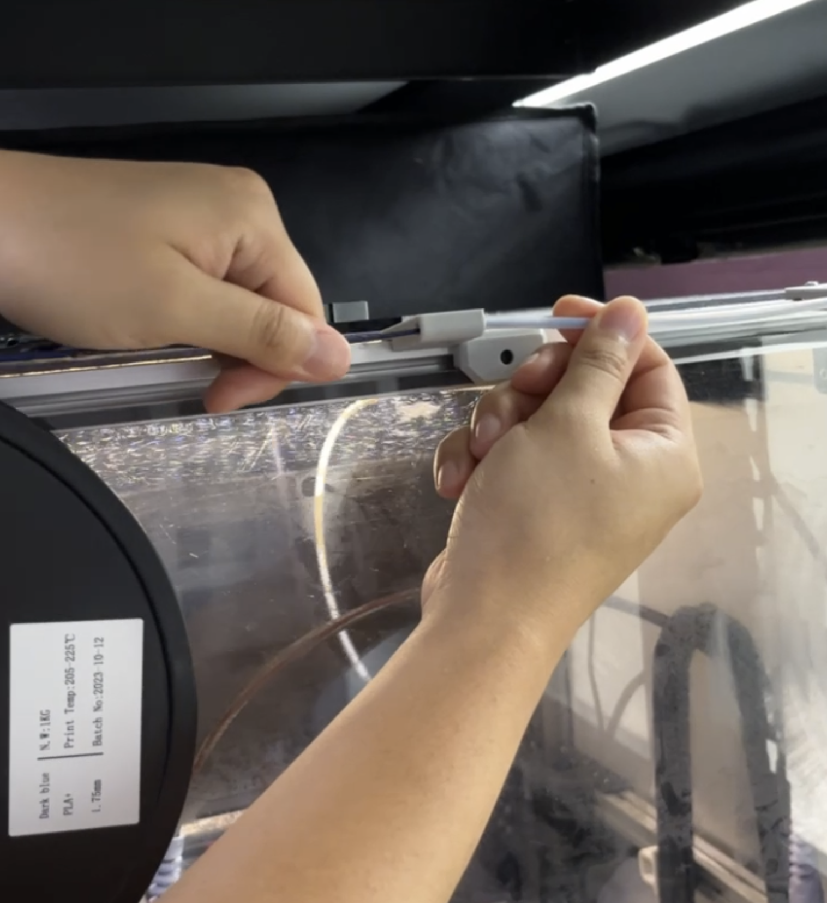

기존 스풀 홀더에 보빈을 걸어주시고 위 사진처럼 뒤에 튜브를 잡은 채로 필라를 밀어넣어 주세요.

필라멘트 센서가 장착되어 있기에 처음 걸리는 느낌이 든다면 좀더 강하게 밀어 넣으시면 필라멘트 센서를 통과할 것입니다.

마찬가지로 안들어갈 때 까지 밀어넣어주세요.

### 2. 새로운 필라멘트 로딩 - 공통

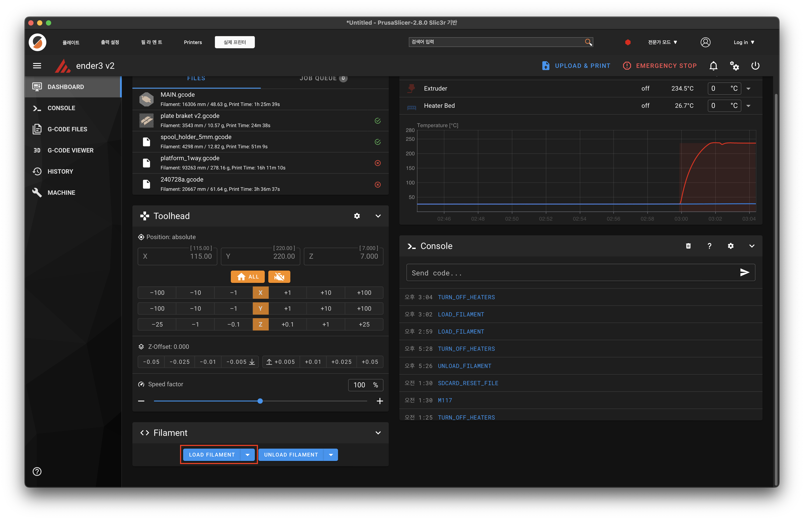

다시 컨트롤 화면으로 돌아와 하단에 있는 load_filament를 눌러주세요.

자동으로 교체온도까지 올라가고 필라멘트 로딩을 시작합니다.

로딩이 끝날떄 까지 대기해주세요.

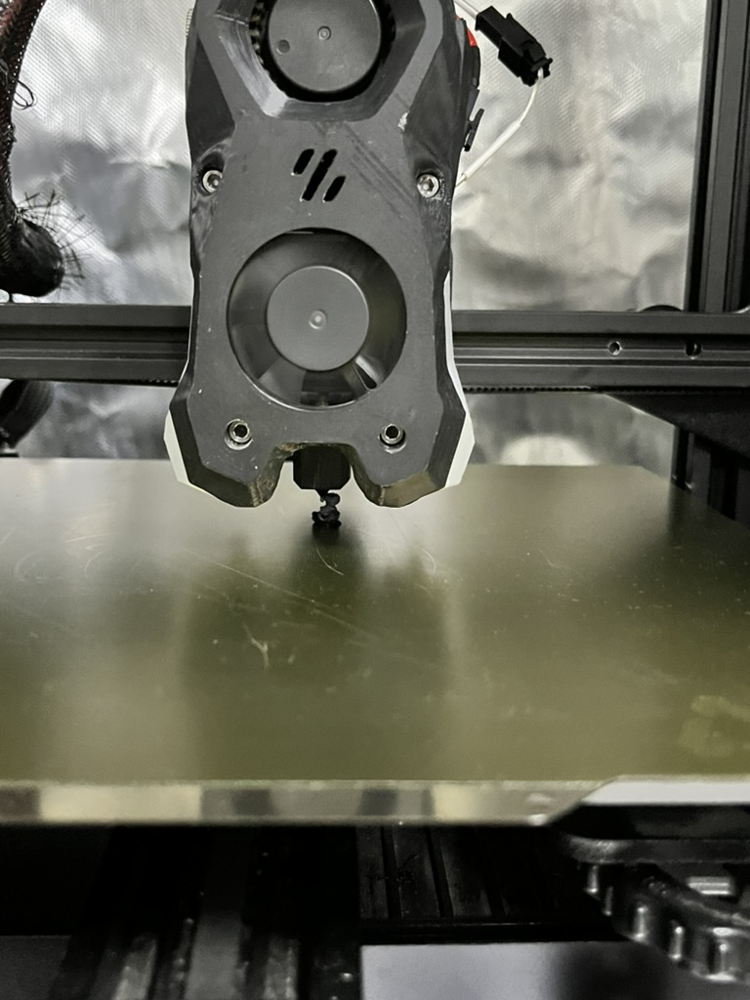

로딩이 정상적으로 완료되면 프린터 헤드를 보았을 때 위 사진처럼 많은 양의 필라가 압출되어 있을 것 입니다. 압출된 필라를 제거하시면 완료가 됩니다.

만약에 필라 압출된 양이 적거나 없다면,

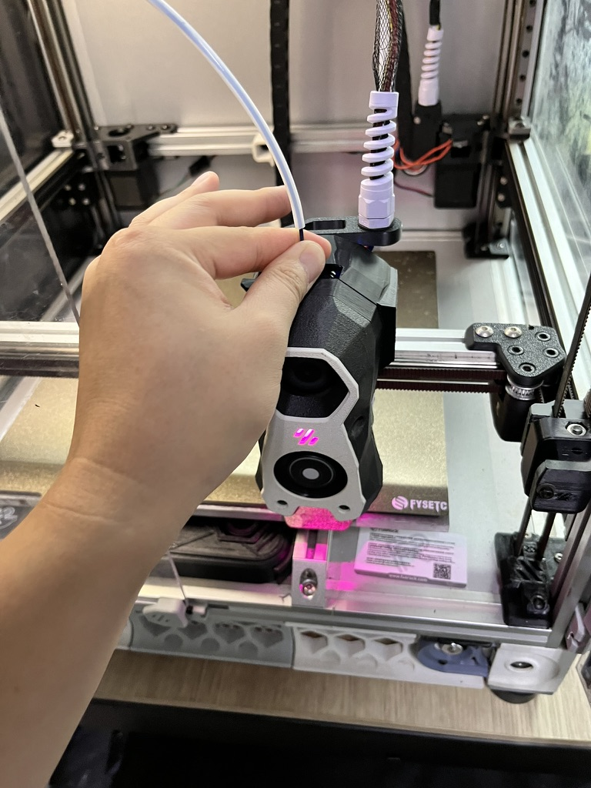

위 사진처럼 ptfe에서 필라를 좀더 빼온후 손으로 툴헤드에 밀어 넣으신 후에 다시 load_filament를 눌러주세요.

### 3. 필라멘트 센서 - Voron 2.4

Voron 2.4에는 필라멘트 센서가 장착되어 있습니다. 따라서 출력 중에 필라멘트가 부족하다면 아래 사진처럼 자동으로 일시정지 합니다.

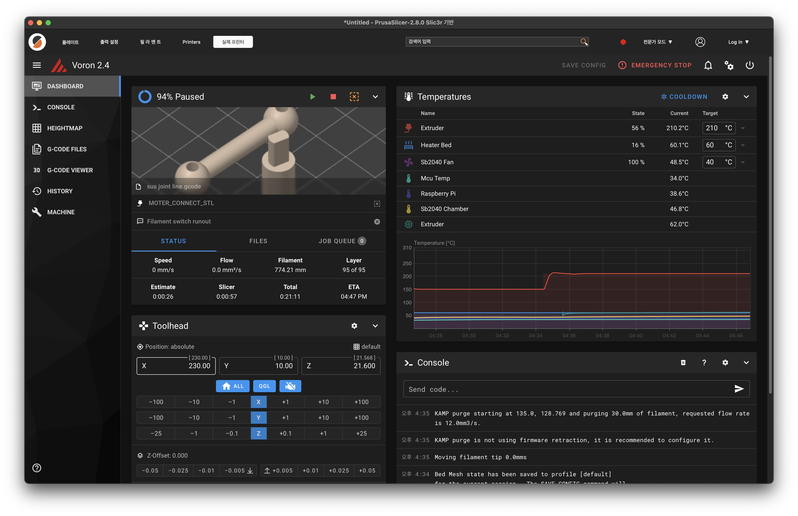

위 사진처럼 필라멘트 부족으로 일시정지 하였다면, 0번부터 2번까지 과정을 통해 필라멘트 교체를 진행하신 후 녹색 재생표시를 누르시면 이어서 출력이 됩니다.

### 4. 출력 중 수동 교체 - Ender3, SP3 Tri

나머지 두 프린터에는 필라멘트 센서가 없습니다. 하지만 중간에 수동으로 일시정지하고 새로운 필라멘트로 교체할 수 있습니다.

작업 과정 보여주는 부분에 노란색 작대기 두개가 세로로 놓여있는 흔히 아는 일시정지 모양의 버튼을 누르시면 일시정지가 됩니다.

일시정지 후 0번부터 2번까지 과정을 통해 필라멘트 교체를 진행하신 후 녹색 재생표시를 누르시면 이어서 출력이 됩니다.