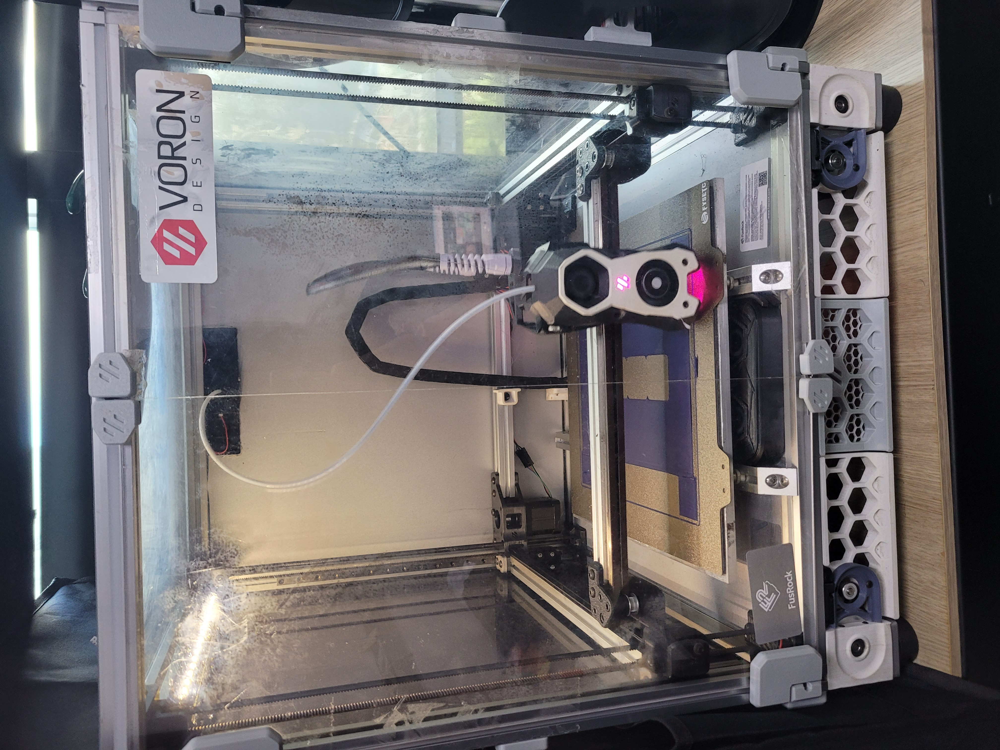
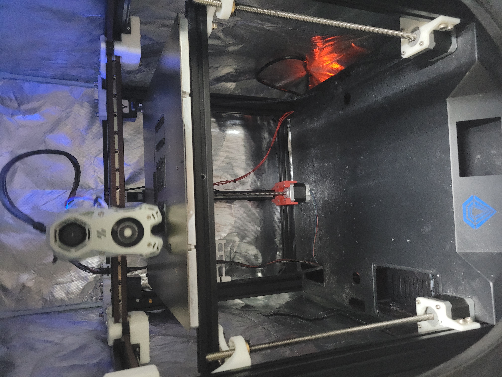

# Voron 2.4 300mm

빌드 사이즈 300 * 300 * 200을 가진 프린터로 기본적으로 PLA 세팅만 제공합니다. 추후 ABS사용에도 문제는 없습니다.

기본적으로 Voron 2.4의 bom 및 조립 가이드 기반으로 빌드하였지만, 프레임에 사용된 프로파일이 미스미 규격이 아닌 국산 프로파일로 홈이 5mm입니다.

이에 따라 수정된 출력 파일을 사용하였고 해당 파일을 정비가이드에 첨부하였습니다.

# Sapphire plus trident

사파이어 플러스 v3 기반으로 Voron trident로 개조한 프린터 입니다.

300 * 300 * 250의 빌드 사이즈를 가졌으며 기본적으로 PLA 세팅만 제공됩니다.

미스미 프로파일을 사용하였으며, 사용된 출력파일의 출처는 아래와 같습니다만 약간에 변형이 들어갔습니다.

https://github.com/pure100kim/Sapphire_Plus_Trident/tree/main

# Ender3

Ender3 v2에서 듀얼 z축, 툴헤드만 Voron stealthburner로 변경된 프린터 입니다.

툴헤드 변경에 따라 y축 빌드 영역이 감소하였습니다. 235 * 200 * 150

이 부분을 해결하기 위해 추후 Voron SwitchWire로 변경할 작업을 고민중에 있습니다.

# [Klipper Firmware](https://www.klipper3d.org)
현재 동아리방에 있는 프린터 모두 Klipper 펌웨어를 사용합니다.

관련 문서는 https://www.klipper3d.org 여기서 확인 할 수 있습니다.

# [Voron](https://vorondesign.com)
동아리의 프린터들은 대다수 Voron Design 기반으로 제작되었습니다.

https://vorondesign.com

오픈소스 프린터로, 제작을 위한 bom과 조립 메뉴얼, 기본 설정법들이 공유되어있습니다.