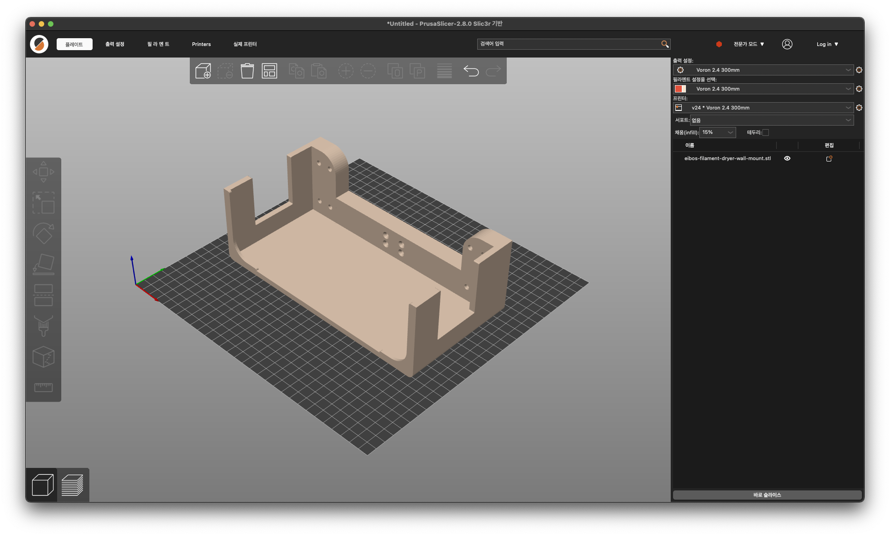
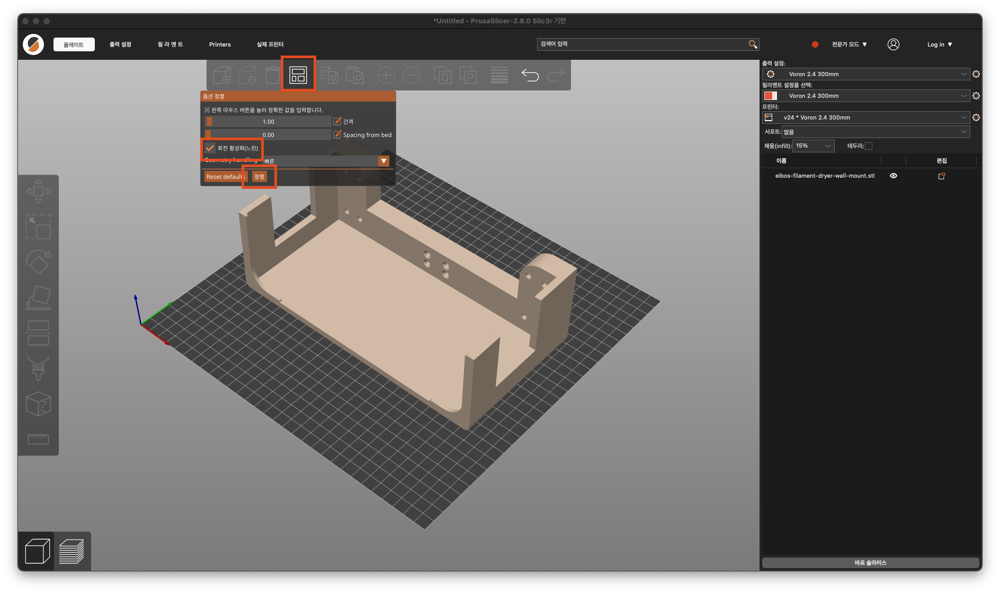
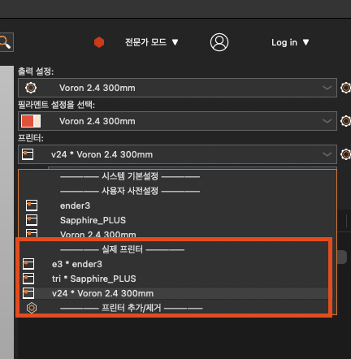
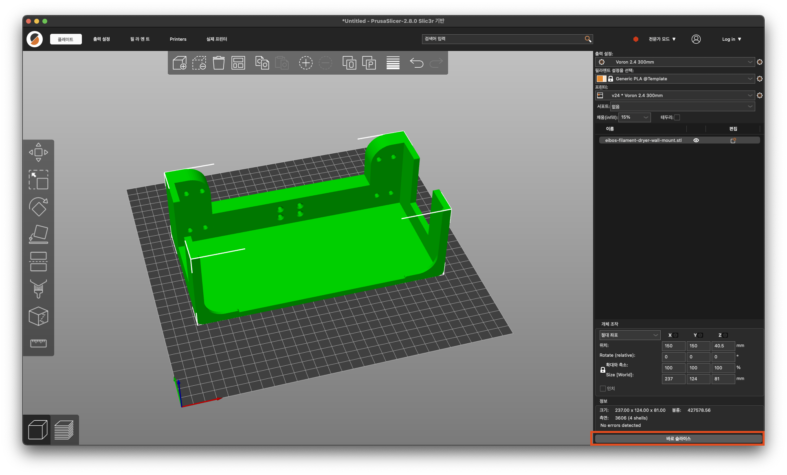
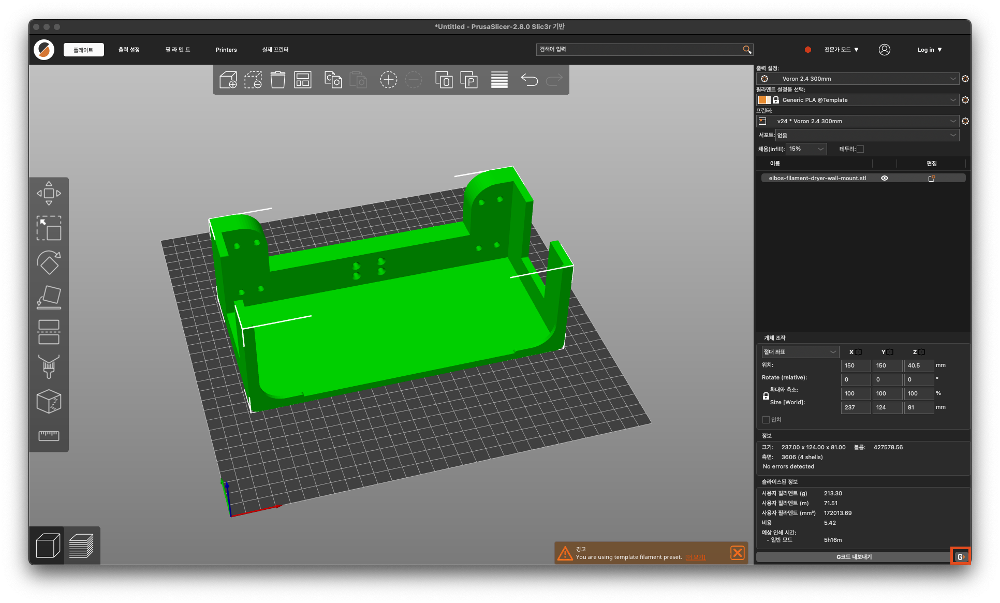
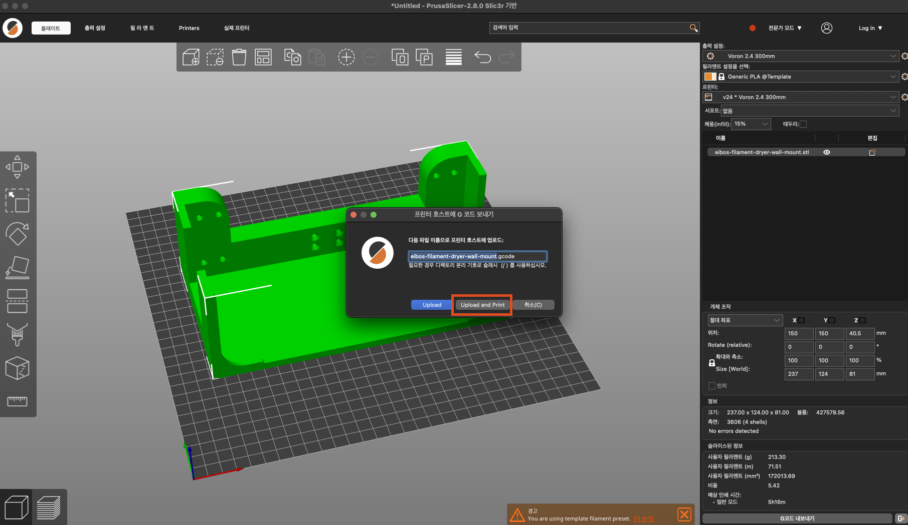

# 프루사 슬라이서 간단 사용법

### 0. 시작하기 앞서 동아리 와이파이에 접속해 있는지 확인

### 1. STL 파일 불러오기

Ctrl + O 혹은 cmd + O 를 눌러서 파일을 열거나 드래그 앤 드롭으로 파일을 가져오시면 됩니다.

### 2. 여러개의 파일 혹은 출력 영역을 벗어나 있는 경우 자동정렬

상단에 있는 다음과 같은 버튼을 우클릭, 회전 활성화 체크 후 정렬 클릭

그러면 기본적으로 자동 정렬이 될 것이고 객체가 파란색으로 표시되며 우측 하단의 다음과 같은 에러가 발생한다면 출력 가능한 사이즈를 넘어선 것이므로 출력이 불가능

### 3. 우측 프린터 부분에서 실제 프린터 중 하나로 선택되어 있는지 확인

### 4. 우측 하단의 바로 슬라이스 클릭 후 완료때까지 대기

### 5. 프린터에 바로 지코드 보내기 

우측 하단의 작은 버튼 클릭

업로드 및 프린트 클릭

업로드 에러가 발생한다면 동아리 인터넷에 접속해 있는지 확인해보고, 이미 프린터가 출력중인지 확인해 볼 것

정상적으로 업로드가 된다면 프린팅이 시작 될 것