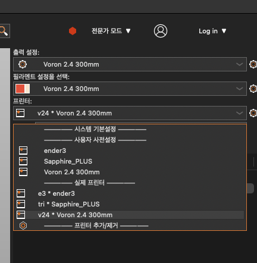

# 프루사 슬라이서 초기 설정법

### 0. ini 파일 다운받기

이 repo의 전체를 다운받는 방법도 있고 위에서 ini 파일만 다운 받는 방법도 있습니다.

ini 파일만 다운받는 방법은 아래를 따라하시면됩니다. 

위에 있는 PrusaSlicer_config_bundle.ini 클릭

우측 상단에 있는 Download Raw File 클릭 후 다운로드

### 1. https://www.prusa3d.com/page/prusaslicer_424/ 해당 링크에서 OS에 맞는 PrusaSlicer를 다운받기

다음과 같은 창이 뜨는데, 10초 기다리시면 슬라이서 설치가 진행됩니다.

### 2. 초기 실행시 뜨는 창에서 취소 클릭

### 3. 상단에 파일 - 가져오기 - 가져오기 구성 및 번들 가져오기... 클릭

### 4. .ini파일을 선택후 열기

해당 과정을 진행하시면 사전에 세팅해놓은 슬라이서 값들이 저장됩니다.

정상적으로 따라하셨다면 슬라이서 우측에 프린터 목록이 생성됩니다. 

사용하고자 하는 프린터를 선택하시고 사용하시면 됩니다.