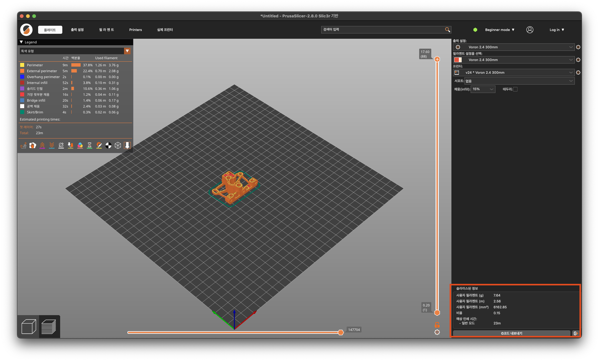
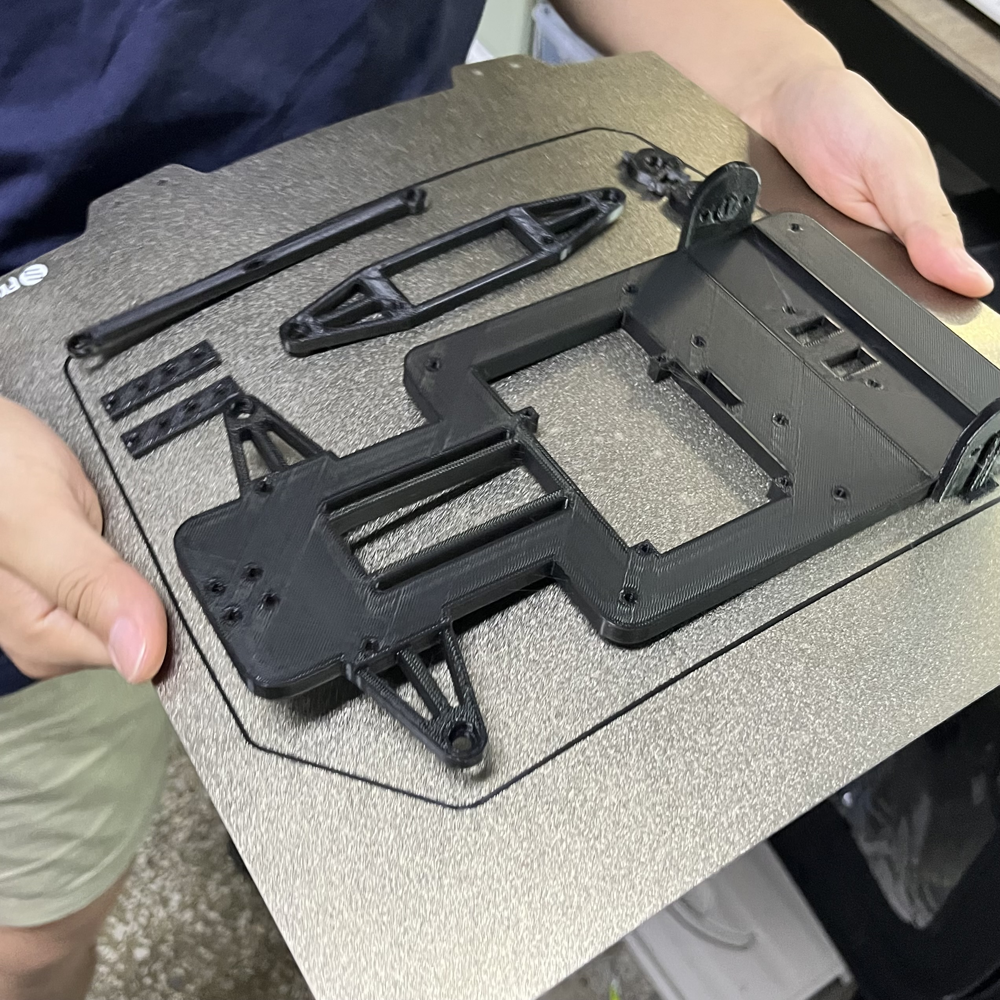

# CHIRO_3DPrinter_GUIDE
이 repo는 중앙대학교 통일공대 로봇 동아리 CHIRO를 위한 3D 프린터 사용 가이드 및 정비 가이드 관련 문서입니다.

# [동아리 프린터](https://github.com/hahihoruragi/CHIRO_3DPrinter/tree/main/Printers)

동아리방에 보유중인 프린터 리스트입니다.

총 3대의 프린터를 운용중에 있으며 종류는 아래와 같습니다.

Voron 2.4

Sapphire Plus v3 trident

ender3

### 출력영역은 "가능한" 사이즈이지 풀로 채우지 않는 것을 추천드립니다. 실패 확률이 높습니다.

해당 프린터의 사진은 위 소제목을 클릭하면 확인하실 수 있습니다.

# 프린터 사용 기록 일지 작성을 하시고 사용해주세요

### 꼭 시트에서 작성하시고 사용해주세요. 시트에 적혀있지 않는 경우, 취소시킬 수 있습니다.

우측 하단에 보면 소요시간, 필라멘트 사용량이 계산되어 나옵니다.

이 내용을 링크에 있는 스프레드 시트에 작성해주시면 되는데, 프린터를 맞게 선택하였는지 확인하시고 작성해주세요.

### 꼭 프린터 3대 이미지를 확인하시고 실제 가동 프린터와 예약 리스트의 프린터를 맞춰서 작성 부탁드립니다.

3D 프린터별로 시트가 있습니다. 맞는 프린터에 작성해주세요

작성되어있지 않는 상태로 출력중인 경우, 취소될 가능성이 있습니다.

# [동아리 Prusa Slicer 사용법](https://github.com/hahihoruragi/CHIRO_3DPrinter/tree/main/PrusaSlicer)
슬라이서는 프루사슬라이서를 선택하였습니다.

위의 제목을 클릭하면 프루사슬라이서 초기 설정법 화면으로 이동합니다.

# 출력 이후 출력물 제거 방법

### 절대로 금속 헤라나 칼을 이용해서 제거하지 마세요.
### PEI시트 손상됩니다.
### 출력직후 바로 제거하실 경우 뜨거우니 장갑을 끼시고 제거하시거나 식으면 제거하세요

베드 시트를 통째로 떼어내서 살짝 휘어주면 쉽게 제거가 됩니다. 작은 부품들의 경우 시트가 베드에 붙어있는 상태에서도 손으로 잡고 톡하고 띄어주시면 분리되는 경우도 있습니다.

### 다시한번 이야기 하지만 절대로 금속 헤라나 칼과 같은 날카로운 도구로 제거하지마세요.

# [필라멘트 교체방법](https://github.com/hahihoruragi/CHIRO_3DPrinter/tree/main/Maintenance_Guide/Filament_Change)

필라멘트 교체 방법입니다. 위 제목을 클릭하시면 상세 게시물로 이동됩니다.
